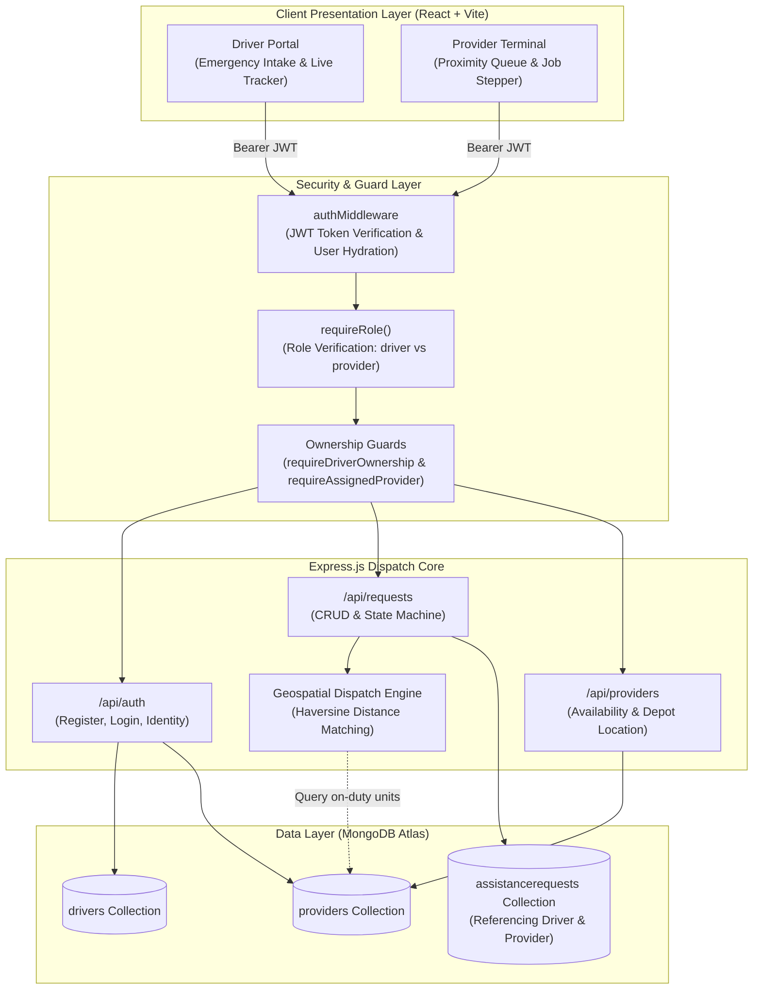

# ResQDrive

**On-Demand Roadside Vehicle Breakdown Assistance & Intelligent Dispatch System**

[](https://nodejs.org/)
[](https://expressjs.com/)
[](https://www.mongodb.com/atlas)
[](https://react.dev/)
[](https://github.com/prathameshmore07/ResQDrive)
[](LICENSE)

> A production-ready, cloud-native roadside assistance dispatch platform that pairs stranded motorists with certified recovery technicians through automated geospatial proximity matching, role-guarded access controls, and a strict workflow state machine.

---

## Overview

Vehicle breakdowns on expressways and urban corridors create acute safety hazards and commuter distress. Traditional roadside dispatch relies on fragmented phone trees, manual call routing, and opaque technician ETAs.

**ResQDrive** solves this by providing a unified, real-time emergency dispatch platform:
- **Motorists (Drivers)** can log an emergency roadside call in seconds with GPS coordinates, specific vehicle particulars, and verified breakdown categories.
- **Service Providers** operate a dedicated operational terminal to monitor localized queues, claim incidents, navigate to motorists, and update job progress.
- **The Core Engine** enforces strict resource ownership and role-based permissions, manages concurrency to eliminate double-booking, and maintains an immutable audit trail for every status transition.

---

## Core Features & System Capabilities

### Stranded Motorist Portal
- **Rapid Emergency Intake**: Multi-step incident logging with breakdown classification (Flat Tire, Dead Battery, Engine Stalled, Towing Required, Fuel Depleted, Lockout, and Mechanical Failure).
- **Location Pinpointing**: Landmark addressing coupled with GPS coordinate pinning (`lat`, `lng`).
- **Vehicle Profiles**: Pre-filled motorist vehicle data (make, model, license plate) attached to each dispatch call.
- **Real-Time Incident Tracker**: Linear operational progress visualization (`Logged` → `Dispatched` → `On Site` → `Resolved`).
- **Private Request History**: Drivers inspect and manage **only their own** service calls, with cancellation capability while requests remain pending.

### Service Provider Command Terminal
- **Proximity Dispatch Queue**: Real-time pool of incoming unassigned breakdown calls sorted dynamically by Haversine distance to the provider's base location.
- **One-Click Incident Claiming**: Race-condition-free claiming that atomically marks the provider as busy (`isAvailable: false`) and assigns the call.
- **Scoped Status Progression**: Providers can update **only the requests specifically assigned to them**, progressing calls through enforced lifecycle stages (`ASSIGNED` → `IN_PROGRESS` → `COMPLETED`).
- **Duty Availability Switch**: Real-time operational toggle between **Available (On Duty)** and **Offline/Busy**.
- **Depot & Base Location Management**: Dynamic GPS coordinate and depot address configuration.

### Enterprise Security & Access Guards
- **Stateless JWT Authentication**: Bearer token issuance with cryptographically signed payloads.
- **Role-Based Access Control (RBAC)**: Distinct permissions for `driver` vs `provider` accounts (`requireRole`).
- **Resource Ownership Guards**: `requireDriverOwnership` guarantees motorists cannot view or manipulate other drivers' incidents; `requireAssignedProvider` ensures unauthorized technicians cannot tamper with other units' active calls.
- **Input Sanitization & Validation**: Strict 10-digit mobile number validation, `@` email verification, password length thresholds, and Mongoose schema constraints.

---

## System Architecture



---

## State Machine & Status Workflow

Incident records adhere strictly to an operational state machine. Arbitrary status skipping or illegal transitions are blocked at the controller level:

```
[ PENDING ] ───────────► [ ASSIGNED ] ───────────► [ IN_PROGRESS ] ───────────► [ COMPLETED ]
     │                        │                           │
     ▼                        ▼                           ▼
[ CANCELLED ]           [ CANCELLED ]               [ CANCELLED ]
```

| Lifecycle State | Description | Authorized Actor |
| :--- | :--- | :--- |
| `PENDING` | Request logged by driver; waiting for nearby provider claim or system auto-dispatch. | Driver / System |
| `ASSIGNED` | Provider accepts the request; provider is marked busy (`isAvailable: false`). | Assigned Provider |
| `IN_PROGRESS` | Provider confirms they are en route or on-site diagnosing the vehicle. | Assigned Provider |
| `COMPLETED` | Breakdown resolved; provider availability is automatically restored (`isAvailable: true`). | Assigned Provider |
| `CANCELLED` | Terminal cancellation initiated by driver before on-site work begins. | Driver Owner |

Every transition automatically records an entry into the document's `statusHistory` array with an exact timestamp, actor role, and optional operator note.

---

## Data Models (Mongoose Schemas)

The database schema utilizes relational references (`ObjectId` with `ref`) across three collections:

### 1. Driver Model (`backend/models/Driver.js`)
Represents registered motorists requiring emergency breakdown coverage:
```javascript
const driverSchema = new mongoose.Schema({
  name: { type: String, required: true, trim: true },
  email: { type: String, required: true, unique: true, lowercase: true },
  password: { type: String, required: true, minlength: 6 },
  phone: { type: String, required: true, trim: true },
  vehicle: {
    make: { type: String, default: "" },
    model: { type: String, default: "" },
    licensePlate: { type: String, default: "" }
  },
  role: { type: String, default: "driver", enum: ["driver"] }
}, { timestamps: true });
```

### 2. Provider Model (`backend/models/Provider.js`)
Represents roadside technicians, mobile mechanics, and towing units:
```javascript
const providerSchema = new mongoose.Schema({
  name: { type: String, required: true, trim: true },
  email: { type: String, required: true, unique: true, lowercase: true },
  password: { type: String, required: true, minlength: 6 },
  phone: { type: String, required: true, trim: true, maxlength: 10 },
  serviceType: {
    type: String,
    enum: ["TOWING", "TIRE_REPAIR", "MECHANIC", "BATTERY_SERVICE", "ALL_ROUNDER"],
    default: "ALL_ROUNDER"
  },
  isAvailable: { type: Boolean, default: true },
  currentLocation: {
    address: { type: String, default: "Kharghar Highway Hub, Navi Mumbai" },
    lat: { type: Number, default: 19.0337 },
    lng: { type: Number, default: 73.0645 }
  },
  role: { type: String, default: "provider", enum: ["provider"] }
}, { timestamps: true });
```

### 3. AssistanceRequest Model (`backend/models/AssistanceRequest.js`)
Core breakdown dispatch record referencing both `Driver` and `Provider`:
```javascript
const assistanceRequestSchema = new mongoose.Schema({
  driver: { type: mongoose.Schema.Types.ObjectId, ref: "Driver", required: true },
  provider: { type: mongoose.Schema.Types.ObjectId, ref: "Provider", default: null },
  issueType: {
    type: String,
    required: true,
    enum: ["FLAT_TIRE", "BATTERY_DEAD", "ENGINE_FAILURE", "FUEL_DELIVERY", "TOWING", "LOCK_OUT", "OTHER"]
  },
  location: {
    address: { type: String, required: true, trim: true },
    city: { type: String, default: "" },
    lat: { type: Number, default: null },
    lng: { type: Number, default: null }
  },
  description: { type: String, default: "", trim: true },
  vehicleDetails: {
    make: { type: String, default: "" },
    model: { type: String, default: "" },
    licensePlate: { type: String, default: "" }
  },
  status: {
    type: String,
    enum: ["PENDING", "ASSIGNED", "IN_PROGRESS", "COMPLETED", "CANCELLED"],
    default: "PENDING"
  },
  statusHistory: [{
    status: { type: String, required: true },
    timestamp: { type: Date, default: Date.now },
    updatedByRole: { type: String, enum: ["driver", "provider", "system"] },
    updatedById: { type: mongoose.Schema.Types.ObjectId },
    note: { type: String, default: "" }
  }]
}, { timestamps: true });
```

---

## Geospatial Dispatch Engine

When automated dispatch is triggered, the backend calculates spherical surface distances between the driver's breakdown coordinates and all active, on-duty providers using the **Haversine Formula**:

$$d = 2R \arcsin \left( \sqrt{\sin^2\left(\frac{\Delta \text{lat}}{2}\right) + \cos(\text{lat}_1) \cos(\text{lat}_2) \sin^2\left(\frac{\Delta \text{lon}}{2}\right)} \right)$$

The provider with the minimum distance is atomically locked (`isAvailable: false`) and assigned to the incident. If no provider is immediately within range, the call queues safely in `PENDING` status for nearest manual pickup.

---

## REST API Specification

### Authentication Endpoints (`/api/auth`)
| Method | Endpoint | Access | Description |
| :--- | :--- | :--- | :--- |
| `POST` | `/api/auth/register` | Public | Register new Driver or Provider with validation |
| `POST` | `/api/auth/login` | Public | Authenticate user credentials and return signed JWT |
| `GET` | `/api/auth/me` | Authenticated | Retrieve authenticated user profile |

### Assistance Request Endpoints (`/api/requests`)
| Method | Endpoint | Access | Description |
| :--- | :--- | :--- | :--- |
| `POST` | `/api/requests` | Driver Only | Raise assistance request with location, vehicle & issue type |
| `GET` | `/api/requests/my` | Authenticated | Get requests belonging to logged-in user (Driver's raised or Provider's assigned) |
| `GET` | `/api/requests/pending` | Provider Only | Retrieve unassigned queue sorted by GPS distance to provider |
| `GET` | `/api/requests/:id` | Owner / Assigned | Retrieve single request details with full populated references |
| `PATCH` | `/api/requests/:id/accept` | Provider Only | Claim an unassigned pending request |
| `PATCH` | `/api/requests/:id/status` | Assigned Provider | Advance status workflow (`ASSIGNED` → `IN_PROGRESS` → `COMPLETED`) |
| `POST` | `/api/requests/:id/dispatch` | Driver / Admin | Auto-dispatch request to nearest available provider |
| `PUT` | `/api/requests/:id` | Driver Owner | Modify request location or description while still in `PENDING` status |
| `DELETE` | `/api/requests/:id` | Driver Owner | Cancel assistance request and free assigned provider |

### Provider Management Endpoints (`/api/providers`)
| Method | Endpoint | Access | Description |
| :--- | :--- | :--- | :--- |
| `GET` | `/api/providers/available` | Authenticated | List all active providers currently on duty |
| `PATCH` | `/api/providers/availability` | Provider Only | Toggle availability status between Available and Busy/Offline |
| `PATCH` | `/api/providers/location` | Provider Only | Update provider GPS base location |

---

## Directory Structure

```text
resqdrive/
├── backend/
│   ├── config/
│   │   └── db.js                 # MongoDB Atlas connection manager
│   ├── controllers/
│   │   ├── authController.js     # Auth, register, login, profile resolution
│   │   ├── providerController.js # Availability toggle & depot location management
│   │   └── requestController.js  # Request CRUD, Haversine dispatch, workflow engine
│   ├── middleware/
│   │   ├── authMiddleware.js     # Bearer JWT verification & user hydration
│   │   ├── ownershipMiddleware.js# requireDriverOwnership & requireAssignedProvider
│   │   ├── roleMiddleware.js     # requireRole RBAC guard
│   │   └── validationMiddleware.js# Request payload validation
│   ├── models/
│   │   ├── AssistanceRequest.js  # Central dispatch document schema
│   │   ├── Driver.js             # Motorist schema with vehicle details
│   │   └── Provider.js           # Recovery technician schema with service types
│   ├── routes/
│   │   ├── authRoutes.js         # /api/auth router
│   │   ├── providerRoutes.js     # /api/providers router
│   │   └── requestRoutes.js      # /api/requests router
│   ├── .env.example
│   ├── package.json
│   ├── postman_collection.json   # Exported test requests
│   └── server.js                 # Express server bootstrap & error middleware
├── frontend/
│   ├── public/                   # Static icons, favicons, typography assets
│   ├── src/
│   │   ├── components/
│   │   │   ├── ui/               # Reusable UI component library (Badge, Button, Card)
│   │   │   ├── AuthView.jsx      # Role-aware login & registration views
│   │   │   ├── DriverPortal.jsx  # Motorist intake form, live tracking & history
│   │   │   ├── LandingView.jsx   # Public product landing page
│   │   │   ├── MapView.jsx       # MapLibre GL mapping & route rendering
│   │   │   ├── Navbar.jsx        # Navigation bar & session controls
│   │   │   └── ProviderPortal.jsx# Provider dispatch queue & operational console
│   │   ├── api.js                # Centralized Fetch abstraction with JWT interceptor
│   │   ├── App.jsx               # Application coordinator
│   │   ├── index.css             # Design system styling & responsive layout tokens
│   │   └── main.jsx              # React DOM root entry
│   ├── .env.example
│   ├── package.json
│   ├── vercel.json               # SPA routing rewrite configuration
│   └── vite.config.js            # Vite bundler configuration
├── screenshots/                  # Application UI screenshots
├── .gitignore
├── CONTRIBUTING.md
├── DATABASE_SETUP.md
├── LICENSE
├── PROJECT_DOCUMENTATION.md
└── README.md
```

---

## Getting Started

### Prerequisites
- **Node.js** (v18 or higher)
- **npm** (v9 or higher)
- **MongoDB Atlas** cluster URI (or local MongoDB daemon)

### 1. Clone the Repository
```bash
git clone https://github.com/prathameshmore07/ResQDrive.git
cd ResQDrive
```

### 2. Backend Configuration & Launch
```bash
cd backend
npm install

# Create environment configuration
cp .env.example .env
```

Configure your `backend/.env` with your values:
```env
PORT=5001
MONGO_URI=mongodb+srv://<username>:<password>@cluster0.mongodb.net/roadside_assistance?retryWrites=true&w=majority
JWT_SECRET=your_jwt_secret_key_here_secure
JWT_EXPIRES_IN=7d
```

Start the backend server:
```bash
npm run dev
# Server listening on http://localhost:5001
```

### 3. Frontend Configuration & Launch
In a new terminal window:
```bash
cd frontend
npm install

# Create environment configuration
cp .env.example .env
```

Configure your `frontend/.env`:
```env
VITE_API_URL=http://localhost:5001/api
```

Start the frontend development server:
```bash
npm run dev
# Application accessible at http://localhost:5173
```

---

## API Testing & Seed Credentials

A complete, pre-configured collection is included at `backend/postman_collection.json`.

### Pre-Configured Demo Accounts
| Role | Email | Password | Details |
| :--- | :--- | :--- | :--- |
| **Driver** | `rahul@driver.com` | `password123` | Motorist in Navi Mumbai with Hyundai Creta |
| **Provider** | `apex@provider.com` | `password123` | Towing & Flatbed recovery unit in Kharghar |
| **Provider** | `metro@provider.com` | `password123` | Tire & Battery repair mobile unit |

---

## License

This project is open-source and licensed under the [MIT License](LICENSE).
